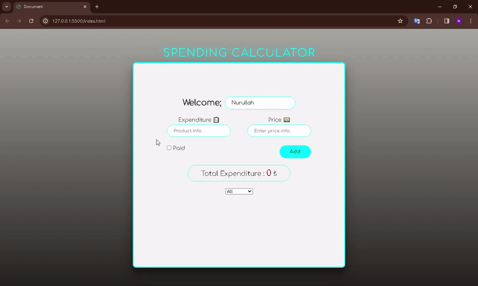

<h1>Spending Calculator</h1>

Proje giriş sayfası kullanıcı adı girişi , harcama türü ve harcama miktarı giriş bölümlerinden oluşturulmuştur.Kullanıcıya yapılan harcama türünü ödendi veya ödenmedi şekilde giriş yapma imkanı sunulmuştur.Eğer kullanıcı yapılan harcamanın türünü ödendi olarak işatretler ise yapılan işlem sayfanın liste kısmına üzeri çizili olarak ve rengi soluk olarak gösterilmiştir. Ayrıca son kısımda kullanıcının yapmış olduğu tüm harcama işlemlerini düzenli şekilde görebilmesi için tüm harcamalar , ödenen harcamalar ve henüz ödemesi yapılmamış harcamalar şeklinde filitreleme imkanı sunulmuştur.Yapılan tüm ekleme ve çıkarma işlemleri ekranda bulunan Toplam Harcamalar kısmında güncel olarak işlenmiştir.

<h2>Kullanılan Teknolojiler</h2>

-HTML5
-CSS
-JavaScript

<h2>Kütüphaneler</h2>

Gooogle Fonts

-Gif-

